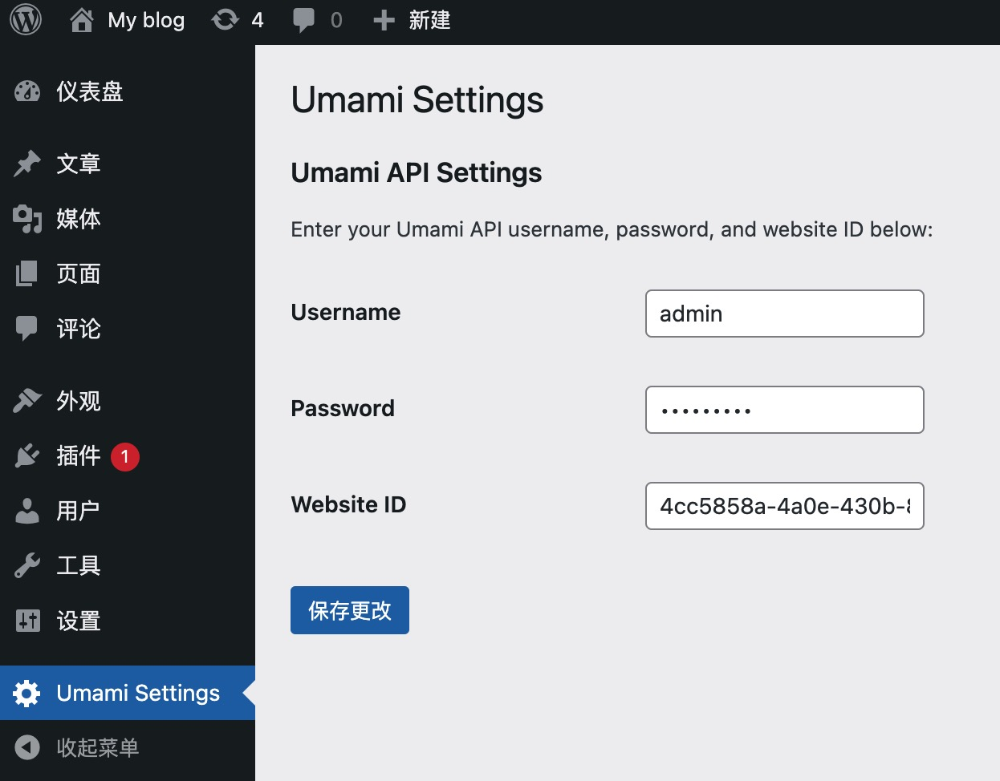
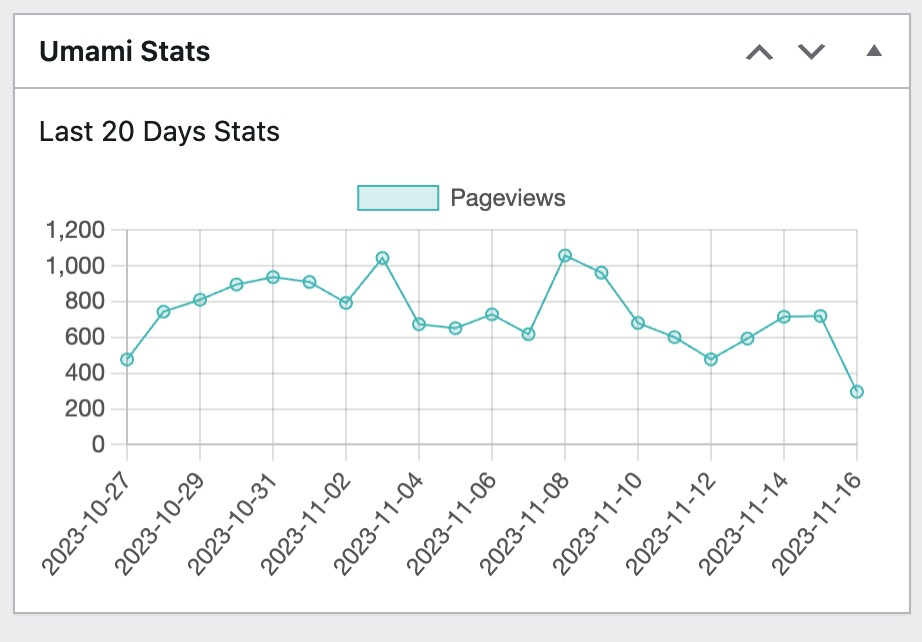

=== Wordpress Umami Status Plugin ===  

Contributors: obaby  
Tags: 统计  
Donate link: 捐款链接地址
Requires at least: 5.0  
Tested up to: 6.4.1  
Requires PHP: 7.1  
Stable tag: 1.8
License: CC BY-NC-SA 2.5 CN DEED  
License URI: https://creativecommons.org/licenses/by-nc-sa/2.5/cn/  

链接自建 umami 站点，展示最近 20 天 pv 数据。  

== Description ==  
链接 umami 站点在后台展示相关统计数据，启用插件之后进入设置页面设置用户名，密码等信息。然后进入 dashboard 即可看到统计数据。  

== Installation ==  
Install Wordpress umami status plugin either via the WordPress.org plugin directory or by uploading the files to your server.  

== Frequently Asked Questions ==  
1. 启用之后仪表盘的 WP Mail Smtp 统计失效？  
由于引用了最新的 chart.js 导致 WP Mail Smtp 数据格式出错，可以尝试禁用相关插件  

== Screenshots ==  
1. 设置界面：  
2. 统计界面：  

== Changelog ==
=== 1.8 ===
增加服务器地址配置  

== Upgrade Notice ==
